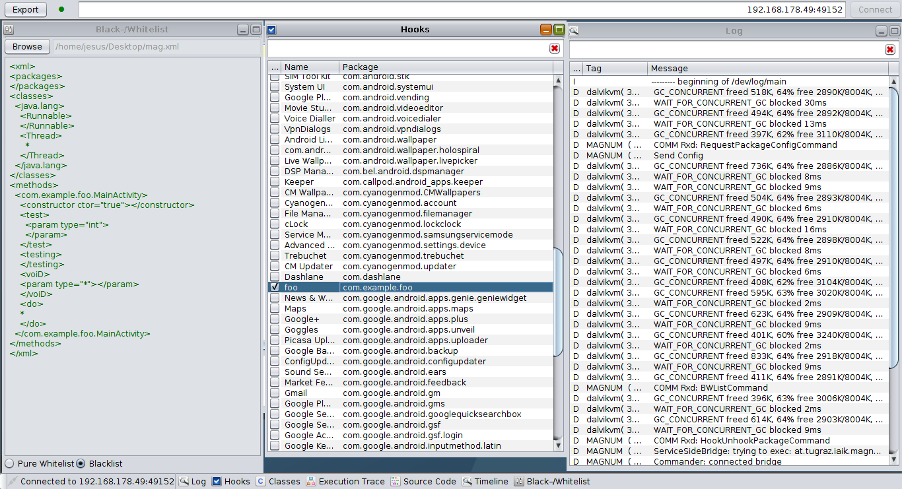
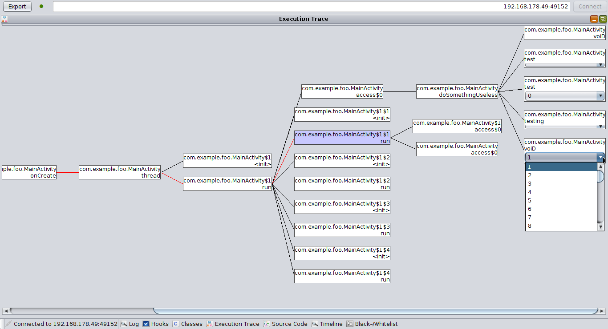

# Magnum PI

 Magnum - Package Inspector

## Introduction
Magnum PI is a tool for live dynamic application analysis on Android developed at Graz University of Technology.   
License: GNU General Public License as published by
  the Free Software Foundation, either version 3 of the License, or
  (at your option) any later version. (For more information refer to the file COPYING.)

As smartphones are ubiquitous and carry our most personal information they are not only viable targets for attacks, but security and correctness of applications are especially important on such devices.
Furthermore Android's permission system is not only complex but in some cases not very expressive.

Magnum PI provides a way to analyse Android applications at runtime, yielding comprehensive information about the inner workings of applications.
For example, more and more people know not to reuse passwords but rather rely on a password safe. However, an insecure password safe (or worse: well disguised spyware) poses a threat. The Google Play Store offers lots of different password safes all of which are praised by their developers as *the best, most secure* one of all.
Magnum PI makes it possible to check if applications live up to the promise a high level of security.

## Overview
Magnum PI relies on the [XPosed](http://xposed.info/ "XPosed") framework to instrument application code at runtime. A client running on a PC called *Eve's Dropper*  (pun intended) processes the gathered information which includes:

* The application's APK
* All classes loaded during an applications life cycle
* Every method invocation including
    * Method parameters
    * Return value
    * Calling method

This information is used on the client to visualise the class hierarchy, compute graphical, interactive execution traces and even display the source code of the application (decompiled from the APK). All gathered information can be filtered and exported at any time.

### Mode of Operation
Whenever an application is started, the ClassLoader's *loadClass* method is instrumented before the first class is loaded.
This way Magnum PI is aware of all classes loaded during the execution of an application and can then inject code before and after each and every method call.
The injected code logs these method calls, their parameters and their return values. This data is then sent to a service running on the same Android device through a Unix domain socket.
The client running on a PC connects to this service, receiving all logged information. (See Figure 1)

### Client Features
The client displays LogCat output, the complete hierarchy of all classes loaded, all methods and their invocation (including parameters and return value) during the execution of an application. Furthermore method invocations are stored inside an SQLite database including information about the caller. The database can be queried using standard SQLite syntax and is also used to create interactive visualisations of execution traces. Finally, an integrated decompiler makes it possible to inspect the source code of an application.
In addition to live analysis, it is also possible to export all gathered information for offline analysis.

Since basically (almost) everything happening during an application execution becomes observable, detailed application analysis is possible. Magnum PI has been applied to analyse (and bust) the security of password safes, detect leakage of sensitive information and expose *bad* behaviour of applications.

 Figure 1: Overview

## Gathered Information
Before logging the client needs to be supplied with the application to be analysed (the APK) as well as some additional information about which classes/methods are to be instrumented.
### Transmitted Meta-Data
The following information-gathering events are logged, encapsulated, sent to the service and forwarded to the client:

* **Application Start**
    * APK (necessary to inspect the application's source code)
    * Application's package name

* **Class Load**
    * Package Name
    * Class Name
    * Modifiers

* **Class Fully Instrumented**
    * Class Name

* **Method/Constructor Code Injection**
    * Package Name
    * Class Name
    * Modifiers
    * Method Name
    * Parameter Types
    * Return Type

### Transmitted Run-Time Information
Whenever a method is invoked or returns, all available information (method name, parameters, return value, caller) is transmitted.
Whenever serializing a parameter or a return value is not possible, a JSON representation of the object is being used. If this is also not possible and the class at hand overrides the *toString()* method, a string representation of the object is used, if not only the object's class name and a note indicating that serialization failed is transmitted.
The following events are generated at runtime through the injected code:

* **Method Entry**
    * Package Name
    * Class Name
    * Modifiers
    * Method Name
    * Parameter Types
    * Return Type
    * Identifier (a unique ID for every runtime-event)
    * Previous Identifier (calling method's unique ID, if known)
    * Caller Known (indicating whether the calling method is known)
    * Serialized Method Parameters

* **Method Exit**
    * Package Name
    * Class Name
    * Modifiers
    * Method Name
    * Parameter Types
    * Return Type
    * Identifier (a unique ID for every runtime-event)
    * Serialized Method Return Value

### Limitations
Generally, classes and methods used by Magnum PI cannot be logged as this would lead to infinite recursions. The java.lang package, for example, is off-limits. Because of this method invocations of classes like *StringBuilder* or *BufferedOutputStream* cannot be logged.

Every application has an increased probability of crashing, when being analysed. One source of crashes or errors is different timing since most operations take longer due to the overhead introduced by Magnum PI.

Sadly, the client can also crash due to bugs in the JVM (this manifests itself as a JVM segfault). There are ways to mitigate this behaviour. For example, it seems that the rendering pipeline is very sensitive: Calling *repaint()* outside of the AWT event queue at a high frequency (several hundred repaints per second) is a source of guaranteed crashes.

# Building
## Requirements
* Java 1.7+
* Android SDK (Ice Cream Sandwich or later)
* Apache Maven

Apache Maven is used as the build system. Since Magnum PI consists of an Android application as well as a Java client and these modules share code, the Android application is a build dependency of the Java client. The correct build target for building both is *install*. This will create an apk inside the MagnumApp/target directory as well as a runnable jar *eve_s-dropper-jar-with-dependencies.jar* inside the JavaClient/target directory.

# User Manual
## Installation
Magnum PI consists of two parts: An Android application and a Java client running on the PC.
The Android device needs to be running Android 4.0.3+, has to be rooted and to have  [XPosed](http://xposed.info/ "XPosed") installed. Java 1.7+ is required to run the client.

### On the Device
The magnum-suite.apk has to be installed. Afterwards the Magnum PI XPosed module has to be activated and the device needs to be rebooted.

### On the PC
No installation is required.

## Usage
### Start-Up
The device and the PC running the client need to be connected to the same network.
Once the XPosed module is activated and a network connection is established on the device the Magnum service needs to be started (Magnum PI should show up in the App Drawer).
The running service creates a persistent notification, displaying the device's IP address and the port, the service is listening on.
Once the service is running the client can be started and connected to the service.

### Application Analysis
In order to analyse an application, the Magnum service needs to be running on the device and both the device and the PC running the client need to be connected to the same subnet.

It is advised to close all running applications on the device prior to starting an analysis. It is imperative that the application to be analysed is not already running prior to starting the analysis!

To start an analysis session, start the client, connect to the Magnum service running on the device and enable analysis for this application (see Section *User Interface Description*). When everything is set-up start the application on the device and wait to receive information that can then be analysed live. If too much information is transmitted and the user interface becomes unusable, classes or individual methods can be blacklisted. Blacklisted classes/methods will not be instrumented the next time the application is started, but also further method invocations of the currently running application will not be instrumented any more. However, the processing of incoming messages at the client is very computationally intensive, therefore it is possible that the effect takes some time to manifest itself.
Additionally it is possible to provide a volatile blacklist before connecting, or switching into a mode of pure whitelisting. In this mode, only the specified packages/classes/methods are instrumented (see Section *User Interface Description → Black-/Whitelisting* for details).
The black-/whitelist is considered volatile, because it is not stored anywhere and has therefore to be provided before every connection attempt (if needed).

It is possible to export the gathered information at any time by clicking the *Export* button. All the information currently present in the client is exported into a zip file containing the following entries:

* An XML of the class hierarchy, containing all classes, their methods as well as method invocations
* The contents of the database containing all method invocations including information about caller/callee
* The specified black-/whitelist (if any); depending on whether blacklisting or pure whitelisting was chosen as mode of operation, the name of the black-/whitelist entry will be set accordingly

### Black-/Whitelist XML Format
An example of the format can be found  [here](manual/sample.xml "XPosed"). Whether a definition applies to a package, class or method (constructor) depends on at which level the definition ends. If the attribute *prefix* is set (to any value) inside a package, class or method directive, the resulting declaration is set to be a prefix to be matched. Otherwise exact matching is performed.

The provided sample XML matches the following:

* Packages
    * Packages starting with *java.util*
* Classes
    * *java.lang.Runnable*
    * Classes starting with *java.lang.Thr*
* Methods
    * *com.example.foo.MainActivity.&lt;init&gt;;*
    * *com.example.foo.MainActivity.test/int;*
    * *com.example.foo.MainActivity.testing;*
    * *com.example.foo.MainActivity.voiD/\*;* (exact method name matching, parameters irrelevant)
    * Methods starting with *com.example.foo.MainActivity.do*

## User Interface Description
The client is a single-window application, having multiple internal windows, each serving a single purpose. These can be rearranged, resized and minimised as desired.
The top bar consists of the following features (see Figure 2):

 * Export Button
 * Activity/Connectivity Indicator
 * Service IP Address:Port Input Form
 * Connect Button

 Figure 2: Disconnected Client; all internal windows are minimised.

The bottom toolbar features a connection indicator, as well as buttons to bring individual internal windows to the foreground, in case they are covered by others.
### Client Features/Internal Windows
#### Log
If the device running the Magnum service has ADB-over-network enabled or is connected via USB and has USB debugging enabled, LogCat output will be shown here once connected. The log can be filtered by tag using the text field at the top. (See Figure 3)

If the application being analysed crashes and the (hooked) class responsible for this crash can be identified using the log, it can be blacklisted. Right clicking any entry of the log brings up a popup-menu with a single entry labelled *Unhook*. Selecting it opens up an input dialog where the name of the class to be blacklisted can be entered. This should prevent crashes the next time the application is started.

#### Hooks
Once connected to the Magnum service, the list of all installed applications is shown here. This list can be filtered in the same manner as the LogCat output. Ticking the check-box next to an application enables analysis for this application the next time it is started. (See Figure 3)

#### Black-/Whitelist
Before establishing a connection, a blacklist (or whitelist) of packages, classes and methods (and constructors) can be specified, by either a file or entering XML mark-up into the text area. When loading a black-/whitelist from a file, it is also possible to edit its content before connecting to the Magnum service. After a connection is established, the text colour will either turn red, indicating missing or faulty mark-up, or green when the black-/whitelist was parsed and activated successfully. The radio buttons at the bottom can be used to select the mode of operation. (See Figure 3)

 Figure 3: Connected Client Displaying Log, Black-/Whitelist and Hooks

#### Classes
The left part of the classes window contains a tree displaying all classes that have been inspected, all methods and every method invocation, as well as method parameters and return values.
The number of method invocations is not only displayed as a number next to the method, but also colour-coded using a logarithmic scale. This makes it possible to identify hot-spots -- code parts with high activity.
Upon selecting a method, every invocation of this method is displayed in the right part of the classes window including the parameters passed and the return value. Furthermore the source code of the class of the currently selected method is shown in the Source Code window whenever the selection changes.
Right-clicking a method opens a menu making it possible to prevent individual methods from being hooked, or define a threshold (*Trigger*) of the number of invocations necessary before any logging takes place.
Classes can also be blacklisted in the same manner, preventing them from being hooked at all. (See Figure 4)

#### Timeline
All method invocations are logged into an SQLite database. The timeline provides a way of showing part of this database by specifying SQL (SQLite) queries in the text field at the top. Changing the query needs to be confirmed by pressing return. The contents of the table are updated every 300ms. A ring buffer provides a history of all queries entered. The history can be browsed using the up/down arrow keys.
The bottom part of the window displays humanly readable details of the selected invocation. (See Figure 4)

 Figure 4: Connected Client Displaying Classes and Timeline

#### Execution Trace
Selecting an invocation in the timeline window triggers the computation and visualisation of the execution trace leading to this invocation. The currently selected invocation is highlighted, as well as the path leading to it.
This trace is interactive; nodes representing method invocations can be left-clicked on, displaying all invocations that were preformed in this method, making it possible to further step into an execution trace.
Furthermore a right click displays a context menu containing the following (see Figure 5):

* Invocation details (the same information that can be shown in the timeline)
* Menu entries to perform the following actions:
	* Calculating the trace (path) leading to the selected invocations
	* Showing the source code of the class containing the invoked method
	* Removing the current node and (recursively) all child nodes
	* Pruning the path leading to this invocation

Furthermore invocations of the same method inside another are grouped, showing a drop-down box containing the parameters of the individual invocations. Individual invocations can be extracted from such a joint node by selecting it from the drop-down box. (See Figure 6)

 Figure 5: Connected Client Showing the Execution Trace and the Node Pop-Up Menu

 Figure 6: Connected Client Showing the Execution Trace with Joint Nodes

#### Source Code
This window shows individual Java classes, decompiled from the APK of the currently analysed application. This window presents itself automatically after selecting the *Show Source* entry of the popup-menu shown, when right-clicking a node in the execution trace. The class to be shown is determined from the node. (See Figure 7)

 Figure 7: Connected Client Showing the Execution Trace and Source of the Selected Node

# Architecture
As already sketched, Magnum PI consists of three parts:

* An XPosed module, hooking methods
* An Android application and -service, handling communication between the client and the hook
* An interactive graphical client run on a PC, receiving logged information

Figure 8 depicts the overall architecture of the system: Code to log information gets injected into the application to be analysed using an XPosed module (the Magnum hook).
The Magnum hook connects to the Magnum service running on the device using a Unix domain socket. The socket named after the application's name is only open if this application is set to be analysed. (This setting is stored at the service and can be changed in the client.)
The service forwards all information received from the Magnum hook to a connected client. The service can handle multiple simultaneously active hooks, but the client can't (the service also does not forward any information to the client indicating which application is currently active).

All information sent from the Magnum hook is encapsulated into *TransportObjects*, control messages (e.g. hooking applications, unhooking methods, ...) are called *Commands*. In both cases a command pattern is employed to trigger an action after a message was received.

 Figure 8: Architecture

## Magnum Hook (Information Gathering)
Module: MagnumApp
Class: at.tugraz.iaik.magnum.hook.MagnumHook

When an application which is to be analysed is started, the ClassLoader's loadClass Method is hooked.
This ClassLoader hook, having the information about all classes being loaded, is then able to iterate over all methods and constructors of every class being used in the application, and hook into these, logging method invocations, parameters and return values.
Furthermore, for every thread started, a stack is created, keeping track of the order of method invocations, making it possible to generate execution traces throughout thread boundaries.
This approach follows Java's hierarchical threadding-model.

 Static and dynamic black-/whitelisting, dynamic hooking and unhooking as well as defining triggers to start gathering information is supported.

Note that blacklisting can in some rare cases lead to distorted execution traces.

### Static Black-/Whitelisting
Class: at.tugraz.iaik.magnum.hook.StaticBlackWhiteList

Hooking certain classes or methods crashes any application or may even cause bootloops. Therefore a static black-/whitelist is part of the codebase containing arrays of class names and method names that may never be hooked, as well as an array of hardcoded exceptions.

### Dynamic Black-/Whitelisting
Class: at.tugraz.iaik.magnum.hook.data.Registry

The client allows for defining a dynamic blacklist or whitelist complementing the static one. This information is received upon starting an application from the Magnum service. When in blacklisting mode, packages, classes and methods (and/or prefixes) blacklisted are not hooked.

The second mode of operation is a pure whitelisting mode. The static black-/whitelist is still respected, but only explicitly stated packages, classes and methods are being hooked.

### Dynamic Unhooking, Triggers
Class: at.tugraz.iaik.magnum.hook.data.Registry

In addition to these two mechanisms, classes and methods can be unhooked on demand and triggers can be defined.
Classes can either be blacklisted in a third way at the client. The next time an application is started, classes blacklisted in this manner will be ignored.
Methods support three states of dynamic (un)hooking:

* **None:** This method is blacklisted.
* **Full:** Default
* **Trigger:** A number of (user defined) invocations of this method is necessary before any invocations (not only of this method, but **any** method) are logged.

## Magnum Service (Settings Management, Information Forwarding)
Module: MagnumApp
Package: at.tugraz.iaik.magnum.app

The Magnum service connects the hooked applications and the client. For every application that is to be hooked, a Unix domain socket is opened; to connect to the client a TCP/IP socket is opened.
Information about the applications to be hooked, dynamic unhooks/triggers and dynamically blacklisted classes is stored as SharedPreferences.

## Eve's Dropper (Information Processing)
Module: JavaClient

At the client, every *TransportObject* received is forwarded to a state machine, which is then (depending on the type of the *TransportObject*) consumed by an EmitListener asynchronously. A thread pool is used, utilising multi-core and multi-processor systems. However this process is still computationally intensive, so a high-end system is needed to be able to analyse complex applications.

# Implementation Overview
This section outlines the package structure of Magnum PI.

## Magnum Service, Magnum Hook
The module MagnumApp bundles the service and the hook.

* **at.tugraz.iaik.magnum** (Mostly) shared code of service and hook
    * **conf** Constants, configuration data structures, management of SharedPreferences
    * **util** JavaNameHelper class to generate unique strings from method definitions

* **at.tugraz.iaik.magnum.data** Common data structures used by service, hook and client to exchange information
    * **cmd** Command Data Structures
    * **transport** TransportObject Data Structures

* **at.tugraz.iaik.magnum.app** Magnum service, splash screen, *Toast* messages
    * **cmd** Processing of incoming commands from the client
    * **ipc** Code for communicating with the hook: service-side bridge, supervisor, reader and writer
    * **net** Code for communication with the client: PC-Comm, supervisor, reader and writer

* **at.tugraz.iaik.magnum.hook** Magnum hook and utility classes used by the hook
    * **cmd** Processing of incoming commands from the service
    * **data** Static black-/whitelist, registry containing session settings such as dynamic black-/whitelisting and triggers
    * **ipc** Code for communication with the service: hook-side bridge, supervisor, reader and writer

## Eve's Dropper (Client)
The module JavaClient contains the graphical client used for application analysis.

* **at.tugraz.iaik.magnum.client** Main client codebase
    * **gui** All GUI related code, main application window, GUI constants
        * **utils** Simple table models, utility class managing the state of the client's internal windows
        * **widgets** Custom Swing components such as  custom internal windows, clearable text fields, text fields supporting a command history
            * **trace** Graphical invocation trace component
            * **tree** Code responsible for rendering the class tree component

    * **net** Networking code to establish a connection to the Magnum service and read ADB LogCat output; message-receiving state machine handling incoming *TransportObjects*
    * **util** Various client utility classes, dependency injection, generation of humanly readable strings from method invocations, parsing of XML black-/whitelists
      *  **datatypes** Utility data types: SortedList, RingBuffer, DBInvocation, BlackWhiteListContainer

* **at.tugraz.iaik.magnum.dataprocessing** Code to do the actual processing of incoming TransportObjects

* **at.tugraz.iaik.magnum.model** Data structures modelling the class hierarchy, methods and invocations received

# Related Work
This section covers other tools for **dynamic** application analysis on Android.
## [TaintDroid](http://www.appanalysis.org)
TantDroid implements taint-tracking on Android by means of a modified version of Android. The primary goal is to check for leakage of sensitive information.

### Extension Providing Password Source and Crypto Sinks
[frameworks_base](https://github.com/f0rki/android_platform_frameworks_base)
[libcore](https://github.com/f0rki/android_platform_libcore)
This extension by Michael Rodler provides a modified TanitDroid source that tracks information entered into password fields ('passwords'). Additional sinks are also provided. This combination yields information about how passwords are used, making it particularly useful to analyse passwords safes

##[DroidBox](https://code.google.com/p/droidbox/)
DroidBox was one of the first dynamic application analysis tools avaiable on Android. It utilises TaintDroid and analyses a predefined set of operations.

###[APIMonitor](https://code.google.com/p/droidbox/wiki/APIMonitor)/[ApkIL](https://github.com/kelwin/apkil)
These tools allow for instrumenting .apk files. This can be used to log method calls.

## [AndroidHooker](https://github.com/AndroidHooker/hooker)
Utilising [Cydia Substrate](http://www.cydiasubstrate.com/) it works similar to Magnum PI, though only a subset of api calls are hooked. The results are stored in an Elasticsearch database for offline analysis.
